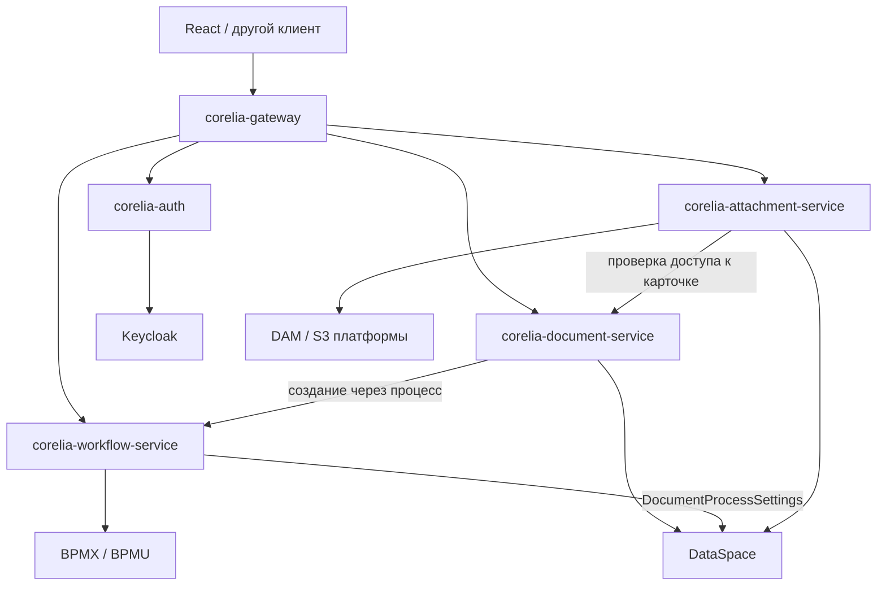

# Архитектура Corelia 0.1

## Границы ответственности

Обратных вызовов к gateway нет. Workflow не зависит от document-service. Document-service не запрашивает вложения: их присоединяет gateway. Attachment-service перед чтением содержимого и изменением метаданных проверяет доступ к документу. Публичные UUID документов должны быть уникальны среди всех типов одного развёртывания: существующая модель Attachment содержит `documentId`, но не код типа. До изменения модели это обязательный контракт.

Хранилища принадлежат платформе. У сервисов Corelia нет общей собственной БД и нет локальных копий бизнес-сущностей. Возможная будущая замена DataSpace, DAM и BPMN разделяется по адаптерам и контрактам, а не выполняется в этой версии. Настройки `providers` принимают только реализованный `platform-v`: неизвестный провайдер останавливает запуск вместо молчаливого переключения.

## Gateway

Gateway — публичный фасад и агрегатор, а не только маршрутизатор. Клиент работает через универсальный `/api/core/v1`; предметные поля и workflow-контекст приходят из соответствующих сервисов.

Gateway может после команды прочитать обновлённую карточку и следующую задачу, чтобы собрать ответ клиенту. Он не вычисляет бизнес-решение и не записывает статус документа самостоятельно. Варианты завершения предоставляются платформой; workflow повторно сверяет параметры команды с актуальными options формы COMPLETIONS. Произвольная запись статуса через маршрут действия задачи не разрешена.

## Связь сервисов

Выбран синхронный JSON/HTTPS с mTLS и поддержкой HTTP/2 на внутренних серверах. Java HttpClient переиспользует соединения; Spring работает на виртуальных потоках. Это сохраняет читаемые контракты и исключает необходимость отдельного брокера для текущего запроса–ответа. Если HTTP/2 не согласован, допустим HTTP/1.1 внутри того же TLS-соединения; перехода на незашифрованный HTTP нет.

Это инженерный выбор для текущих сценариев, а не доказательство максимальной пропускной способности: сравнительные нагрузочные замеры HTTP/2 и gRPC не проводились. gRPC имеет смысл вводить по результатам профилирования для конкретного горячего маршрута. Kafka/RabbitMQ стоит добавлять для событий, уведомлений и длительных фоновых операций, когда появятся их реальные потребители, модель доставки и идемпотентность.

Команды не повторяются автоматически. После таймаута результат процесса может быть неизвестен: он мог выполниться в платформе. Повторное нажатие создания способно создать второй документ. Сквозная идемпотентность требует согласованного ключа и поддержки хранения результата в платформе; эта версия её не имитирует локальным кэшем.

## Авторизация

mTLS отвечает за вызывающий сервис. JWT отвечает за пользователя. Оба условия проверяются независимо. JWT RS256 проверяется локально в каждом приложении: подпись, issuer, exp, nbf и JWKS с кэшем и обновлением ключа при ротации. Пользовательский токен передаётся платформе; пользовательские permissions остаются обязательными. Corelia не выдаёт собственные access token и не хранит пароли.

Карточка документа хранит текущее состояние в `PdsContract` стабильной модели Platform V. История карточки не используется. Вложения версионируются независимо: `Attachment` хранит `logicalAttachmentId`, `version` и `current`; замена атомарно снимает признак текущей версии и создаёт новую запись.

| Получатель | Допустимый клиент |
| --- | --- |
| auth | gateway |
| document-service | gateway; attachment-service только GET |
| workflow-service | gateway; document-service только `/processes` |
| attachment-service | gateway |
| health внутреннего приложения | дополнительно собственный сертификат приложения |

CN проверяется только после TLS-проверки сертификата доверенным CA. Для каждого приложения выпускается отдельная пара ключей. Сертификаты пользователей в эту схему не входят. Для следующего провайдера входа нужно реализовать `IdentityProvider`, затем согласовать стандарт JWT/JWKS с остальными сервисами и платформой. Произвольный opaque token без изменения проверки сейчас не поддерживается.

Текущий password grant Keycloak сохранён ради существующего React. Переход к Authorization Code + PKCE — отдельная совместная задача клиента и auth. Роли извлекаются из токена Keycloak. Дополнительные роли для отдельных логинов в сервисах не назначаются.

## Изоляция и развитие

Каждый заказчик разворачивает собственный набор сервисов в своём контуре. Адреса интеграций и параметры запуска задаются для этого развёртывания. Многопользовательская работа внутри организации использует права платформы; общая система для нескольких заказчиков не планируется.

Библиотека `corelia-common` содержит транспорт и технические компоненты. `corelia-platform-v` — протоколы действующей платформы и контракт обмена для модели ПДС. Каждое развёртывание обслуживает одного заказчика; переключения заказчиков внутри системы нет. Не следует добавлять в common предметные сущности и решения разных сервисов: это снова связало бы их релизы. Интерфейсы `DocumentRepository` и `IdentityProvider` уже отделяют текущие реализации от сценариев; адаптеры процессов и вложений пока ориентированы на API Platform V.
