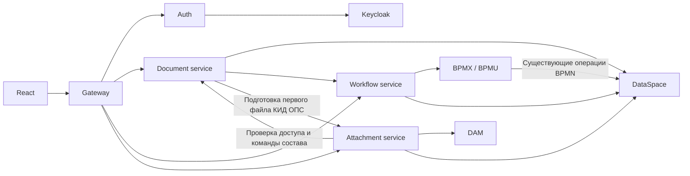

# Реализация и карта кода

Срез локальных исходников: 16 сентября 2026 года. Этот документ объединяет реализованные механизмы; результаты старых проверок не выдаются за новую проверку.

## Компоненты

| Каталог | Что реализовано и где начинать чтение |
| --- | --- |
| `corelia-gateway` | Публичный `/api/core/v1`, маршрутизация и агрегация карточки со снимком файлов и workflow. `CoreController`, `AuthController`, `AttachmentClient` |
| `corelia-auth` | Вход, refresh, logout; `IdentityProvider` и реализация `KeycloakIdentityProvider` |
| `corelia-document-service` | Поиск, создание, реквизиты, версии и состав вложений. `DocumentService`, `DocumentVersionService`, `DocumentPolicy`, репозитории |
| `corelia-attachment-service` | Работа с содержимым в DAM и передача команд состава владельцу документа. `AttachmentService`, `AttachmentController` |
| `corelia-workflow-service` | Запуск BPM, задачи, исполнители, варианты завершения. `WorkflowService`, `TaskGateway`, `TaskPresentation` |
| `corelia-common` | Конфигурация, JWT, безопасность запросов, межсервисный HTTP, ошибки, кэши и служебные функции; здесь также находится контракт `KidOps` |
| `corelia-platform-v` | Библиотека интеграции: `DataSpaceClient`, `BpmClient`, `FileStorageClient`, `DocumentTypes`, `PdsContract`, GraphQL-ресурсы |
| `corelia-system-tests` | Тесты реальных приложений с имитацией платформы, тесты общего алгоритма версий, валидации КИД ОПС, Docker smoke |
| `../sber-npf-react` | React 19, TypeScript, Vite, MUI, Redux Toolkit, React Router |
| `../sber-npf-platform-v` | Модель DataSpace, разрешённые GraphQL, права, справочники, BPMN, комплект поставки |

Ядро использует Java 25, Spring Boot 4.0.8 и Maven. Пять приложений запускаются отдельно, общаются через HTTP; библиотеки не являются отдельными сервисами. Gateway реализован на Spring MVC и Java HttpClient, не на Spring Cloud Gateway.

`corelia` содержит восемь Git-подмодулей. `sber-npf-bff-nodejs` — архивный BFF, не изменять без отдельного запроса. В общей папке также есть `sber-npf-java`: он не входит в целевой контур Corelia, его наличие не является основанием переносить туда изменения.

## Границы и движение данных



У сервисов нет собственной общей базы с копиями бизнес-сущностей. Новые правила документов принадлежат document-service. При этом текущие BPMN создают документы и меняют статусы непосредственно в DataSpace: эту действующую интеграцию необходимо учитывать.

GraphQL и специфику платформы следует удерживать в адаптерах и реализациях репозиториев. Текущее разделение ещё не полностью соответствует этому направлению: например, контракт ПДС находится в библиотеке платформы и используется политикой документа. Не считать будущую заменяемость хранилища уже реализованным вторым провайдером.

## Модель и версии

Общая сущность `Document` отделена от дочерних реквизитов `PdsContract` и `KidOps`. Общие снимки находятся в `DocumentVersion`; отдельной таблицы версий на каждый вид нет. Снимок содержит JSON реквизитов, версию схемы и состав вложений. `DocumentCommand` сохраняет результат команды для повторного запроса. `Attachment` описывает содержимое файла, `logicalAttachmentId` объединяет его историю.

`DocumentVersionService` реализует общий алгоритм, `PdsDocumentPolicy` и `KidOpsDocumentPolicy` — валидацию и проверку прав вида. Репозитории отделяют алгоритм от операций DataSpace. Текущая версия схемы обоих видов — 1; автоматическое преобразование неизвестных исторических схем не реализовано.

Изменение атрибутов закрывает предыдущий снимок через `closedAt`, создаёт следующий и сохраняет реквизиты. Совпадающие нормализованные значения не увеличивают номер. Статус не входит в JSON реквизитов версии и меняется независимо процессом. Текущий состав вложений изменяем; состав закрытой версии сохраняется.

Для PATCH реквизитов клиент передаёт `expectedVersion`, `changeToken` и UUID `requestId`. Файловые операции принимают requestId, а ожидаемое состояние для их фиксации читает document-service. Состав файлов также меняет токен. Пакет DataSpace объединяет проверку ожидаемого состояния, изменения и результат команды. Конфликт возвращает 409; требуется перечитать карточку и согласовать правки с новым состоянием.

Ключ повторной команды связан с документом, пользователем и requestId. Хранятся хеш запроса и ответ: одинаковый повтор возвращает результат, другое содержимое с прежним ключом вызывает 409. После потерянного ответа фиксации ядро проверяет сохранённый результат. Несколько HTTP-запросов общей транзакцией не являются.

Основные файлы: [DocumentVersionService.java](../corelia-document-service/src/main/java/ru/corelia/documents/DocumentVersionService.java), [PlatformDocumentVersionRepository.java](../corelia-document-service/src/main/java/ru/corelia/documents/PlatformDocumentVersionRepository.java), [описание версий](document-versioning.md).

## Создание и процессы

Для ПДС существующий BPMN создаёт `Document` и `PdsContract` одним пакетом с `ref:createDocument`. После появления документа ядро инициализирует v1; повторное чтение или запись может восстановить незавершённую инициализацию. Создание в BPM и инициализация версии не составляют общей транзакции.

Для КИД ОПС document-service сначала проверяет реквизиты и обязательный файл. Attachment-service загружает содержимое в DAM через специальный внутренний маршрут. Затем BPMN создаёт документ, реквизиты, первое вложение и результат создания одним пакетом; ядро инициализирует v1. Остальные файлы форма загружает отдельными командами.

Повтор завершённого создания КИД ОПС с тем же requestId возвращает документ, изменение входа даёт 409. Публичный ID связан с пользователем и requestId и защищён уникальностью. Это не исключает два параллельных запуска BPM до фиксации: проигравший процесс может получить инцидент уникальности. Такие гарантии нельзя автоматически переносить на создание ПДС.

Workflow получает варианты завершения из платформы и сверяет команду с актуальными options формы COMPLETIONS. Gateway может перечитать карточку после действия, но не выбирает бизнес-переход самостоятельно. `approvalStatus` сохраняется в процессном контракте, поле карточки называется `status`.

Процессы: [pdsContractApproval.bpmn](../../sber-npf-platform-v/pdsContractApproval.bpmn), [kidOpsStorage.bpmn](../../sber-npf-platform-v/kidOpsStorage.bpmn). Выбор процесса связан с `DocumentProcessSettings`. Новая версия документа не перезапускает процесс; скопированные в задачи реквизиты автоматически не обновляются.

## Вложения и права изменения

Attachment-service получает вид через внутренний поиск документа по ID и передаёт изменение состава в document-service. Внутренние attachment-commands доступны сертификату сервиса вложений. Правила редактирования не должны дублироваться в файловом сервисе.

Обе текущие политики требуют `document_operator` либо `app_owner`; для изменения дополнительно нужны `IN_WORK` и назначенный исполнитель с ролью `document_operator`. Особое разрешение — первоначальная загрузка создателем в `CREATED`. Одна роль app_owner не отменяет проверку назначения.

DAM получает бинарный файл до фиксации метаданных. Адрес включает документ, uploadId, SHA-256 и имя. При сбое остаётся риск незакреплённого содержимого; автоматической очистки нет. Пакет загрузок состоит из отдельных команд: при повторе важны исходный состав, порядок и requestId. Удаление из текущего состава не означает физического удаления всей истории.

## Внешний React-клиент

Клиент расположен в соседнем репозитории `sber-npf-react`, не входит в Maven-сборку Corelia.

| Область | Файлы относительно `sber-npf-react/src` |
| --- | --- |
| Маршруты и защита сессии | `App.tsx` |
| Главная, реестр, создание, карточка, очереди | `pages/HomePage.tsx`, `DocumentsListPage.tsx`, `DocumentCreatePage.tsx`, `DocumentDetailPage.tsx`, `TasksListPage.tsx` |
| HTTP, авторизация и refresh | `api/client.ts`, `auth.ts`, `authStorage.ts` |
| Адаптация публичного API к UI | `api/documents.ts`, `api/tasks.ts`, `types/document.ts`, `types/task.ts` |
| Состояние | `store/authSlice.ts`, `store/documentsSlice.ts` |
| Поля и проверка формы | `features/documents/components/KidOpsFields.tsx`, `features/documents/utils/documentValidation.ts` |
| Файлы и предпросмотр | `features/documents/components/DocumentFilesList.tsx`, `components/FilePreviewDialog.tsx`, `DocxDocumentPreview.tsx`, `ExcelWorkbookPreview.tsx` |

База API настраивается через `VITE_API_BASE_URL`. PDF открывается в iframe через object URL, DOCX — через docx-preview, XLSX — через ExcelJS. Клиентская проверка реквизитов дополняет обязательную проверку ядра.

## Контракты и безопасность

Публичные маршруты документов, версий, вложений и задач находятся в [CoreController](../corelia-gateway/src/main/java/ru/corelia/gateway/CoreController.java); подробные тела — в [API](api.md). Тип документа передаётся в маршрутах `/documents/{type}/...`, а поиск всех видов и поиск по ID имеют отдельные маршруты.

Внутренние вызовы используют HTTPS/mTLS; сертификат определяет сервис, пользовательский JWT — пользователя. JWT RS256 проверяется локально, JWKS кэшируется с поддержкой обновления. Пользовательский токен передаётся платформе, её permissions сохраняют значение. На хост локального Compose публикуется gateway; внутренние healthcheck также требуют mTLS.

Разрешённые тексты GraphQL в `corelia-platform-v/src/main/resources/graphql` должны соответствовать `../sber-npf-platform-v/model.graphql-permissions.json` и независимой тестовой фикстуре `corelia-system-tests/src/test/resources/platform-v/allowed-requests.json`. Проверка имени операции без проверки тела недостаточна.

## Проверка и запуск

Команды ядра выполняются из корня Corelia; клиент и комплект платформы находятся в соседних репозиториях.

```bash
bash scripts/test.sh
npm --prefix ../sber-npf-react run build
bash ../sber-npf-platform-v/scripts/package-platform-v.sh
```

Для ядра нужны Java 25 и Maven 3.9+. `scripts/up.sh` готовит локальные сертификаты и Docker-контур, `--debug` включает JDWP. Health gateway: `http://localhost:7170/api/core/v1/health`. Health подтверждает запуск приложения, но не исправность внешней платформы. Инструкции по доверию сертификату и портам отладки — в [README Corelia](../README.md).

`CoreliaIntegrationTest` запускает приложения с mTLS и PlatformStub; `DocumentVersionServiceTest` проверяет общий алгоритм; `KidOpsValidationTest` — правила КИД ОПС. DockerSmokeTest включается отдельно через `-DdockerSmoke=true` после сборки образов. Stub не исполняет настоящую модель permissions и не доказывает принятие модели SDK-генератором платформы.

Порядок и границы проверок описаны в [testing.md](testing.md). Состояние рабочего стенда этим обзором не подтверждается.

## Ограничения и места, требующие внимания

- Общая транзакция между DAM, BPM и DataSpace отсутствует. Отдельно учитывать загрузку, фиксацию метаданных, создание процесса и инициализацию v1.
- Проверка текущего исполнителя и изменение статуса из BPMN не атомарны между собой.
- Общей гарантии идемпотентного запуска всех процессов нет; автоматический повтор команды после таймаута может быть опасен для согласованности.

## Как расширять

Для нового вида нужны реквизиты и связь с Document в модели, политика в document-service, чтение и атомарная запись через репозиторий, регистрация типа, permissions, при необходимости процесс и форма React. Отдельный микросервис и отдельная таблица версий на вид не требуются. Правила ПДС нельзя считать общими для всех видов.

При изменении API проверяйте совместно контроллер, сервис, адаптер клиента и тесты. При изменении модели — GraphQL-ресурсы, permissions, BPMN и фикстуру. При изменении процессов отдельно продумывайте совместимость уже запущенных экземпляров.
